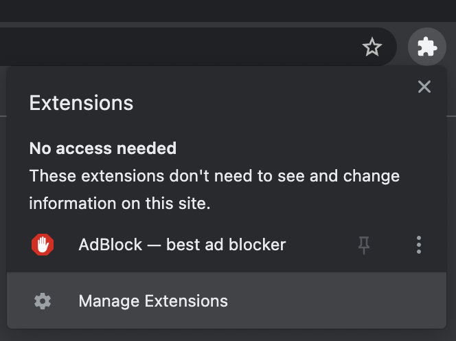
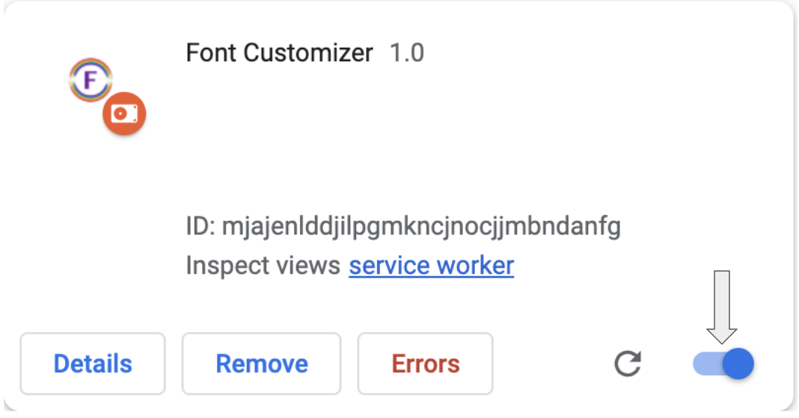

# Font Customizer

Use this extension to quickly customizer your browser's font size, type, and color!

## How to Install

1. Clone repo onto your local machine
2. In the browser, click the extensions icon and select "Manage Extensions"

&emsp; 
 
 

3. Click the "Load unpacked" button and select the cloned repository

&emsp; 
 
 

4. Toggle Extension to begin updating your fonts. Pin the extension to your browser for quick future access!

&emsp; 